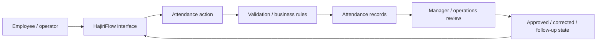
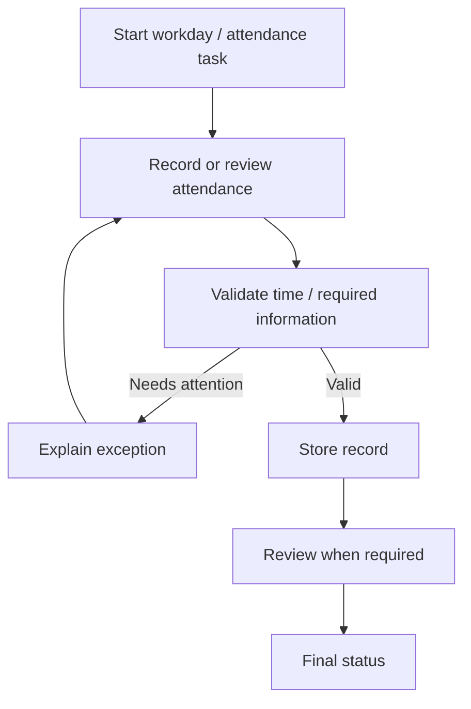
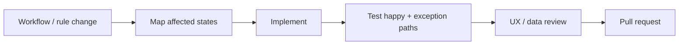

<div align="center">

# HajiriFlow

**An attendance and workforce-flow product repository focused on making daily presence, records, review, and operational follow-up easier to understand.**


[Browse source](https://github.com/Nischhalsubba/HajiriFlow/tree/main) · [Issues](https://github.com/Nischhalsubba/HajiriFlow/issues)

</div>

## Overview

**HajiriFlow** is documented as an attendance-oriented operational product. The README describes the system in human terms first, then maps those ideas to the software so employees, managers, designers, developers, and reviewers can share the same mental model.

| Audience | Focus |
|---|---|
| Employees | Understand attendance actions and status |
| Managers / operations | Review records and exceptions |
| Developers | UI, application rules, data and state transitions |
| Designers | Dense operational workflows, errors, permissions and mobile use |

<details open>
<summary><strong>🏗️ Interactive product architecture</strong></summary>



</details>

## Operational flow



## Getting started

```bash
git clone https://github.com/Nischhalsubba/HajiriFlow.git
cd HajiriFlow
```

Use the committed manifests and lockfiles to determine the current runtime and development commands.

## Product & design principles

Operational software should make state visible. Show what was recorded, when it happened, who can change it, why something is blocked, and what the next step is. Preserve keyboard access, clear tables, responsive layouts, explicit empty/error states, and readable audit context.

## SEO & discoverability

Use terms such as **attendance management, employee attendance, workforce attendance, attendance workflow, time records, and HR operations** only when they accurately describe implemented product behavior. Public metadata should remain specific, useful and non-misleading.

## Contribution flow


