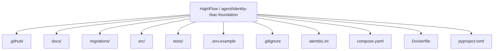
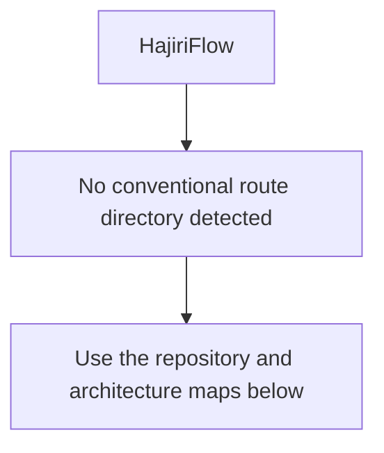
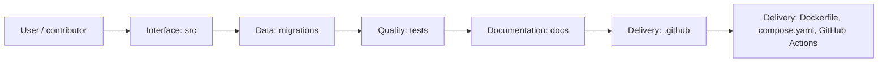
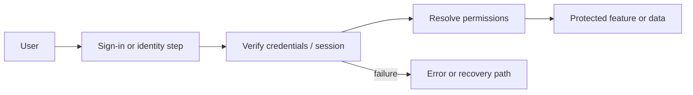
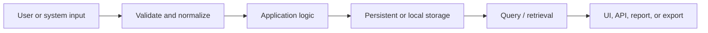
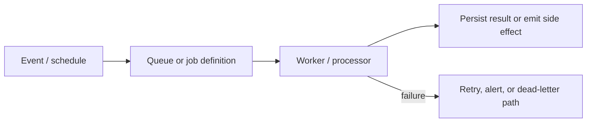
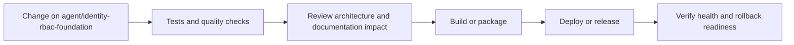
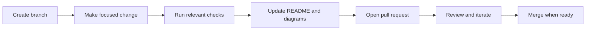

<!-- interactive-readme-standard:start -->

<div align="center">

# HajiriFlow

**Branch-aware technical guide for [`agent/identity-rbac-foundation`](https://github.com/Nischhalsubba/HajiriFlow/tree/agent/identity-rbac-foundation)**

<p>    </p>

<p>
  <a href="https://github.com/Nischhalsubba/HajiriFlow/tree/agent/identity-rbac-foundation"><strong>Browse source</strong></a> ·
  <a href="https://github.com/Nischhalsubba/HajiriFlow/issues"><strong>Issues</strong></a> ·
  <a href="https://github.com/Nischhalsubba/HajiriFlow/codespaces/new?ref=agent%2Fidentity-rbac-foundation"><strong>Open in Codespaces</strong></a>
</p>

</div>

> [!IMPORTANT]
> This guide is generated from the files actually present on `agent/identity-rbac-foundation`. It links to detected source paths, preserves project-authored notes, and avoids claiming components that were not found.

## At a glance

| Item | Detected value |
|---|---|
| Purpose | A Python project documented from the current branch structure and manifests. |
| Branch role | Compared with `main` |
| Stack | Python, Docker, Docker Compose |
| Manifests | pyproject.toml, Dockerfile, compose.yaml |
| Prerequisites | Python |
| Delivery | Dockerfile, compose.yaml, GitHub Actions |
| License | No license file detected |

## Branch scope

This branch differs from the default branch in the following detected paths:

- [`README.md`](https://github.com/Nischhalsubba/HajiriFlow/blob/agent/identity-rbac-foundation/README.md)

## Quick start

```bash
python -m venv .venv
pip install -e .
```

### Configuration surface

- `.env.example`

> Never commit secrets, private keys, production credentials, customer data, or unredacted infrastructure details.

## Repository map



| Responsibility | Detected source paths |
|---|---|
| Interface | [`src`](https://github.com/Nischhalsubba/HajiriFlow/tree/agent/identity-rbac-foundation/src) |
| Data | [`migrations`](https://github.com/Nischhalsubba/HajiriFlow/tree/agent/identity-rbac-foundation/migrations) |
| Quality | [`tests`](https://github.com/Nischhalsubba/HajiriFlow/tree/agent/identity-rbac-foundation/tests) |
| Documentation | [`docs`](https://github.com/Nischhalsubba/HajiriFlow/tree/agent/identity-rbac-foundation/docs) |
| Delivery | [`.github`](https://github.com/Nischhalsubba/HajiriFlow/tree/agent/identity-rbac-foundation/.github) |

## Website or application map



## Architecture and responsibility flow



<details>
<summary><strong>Authentication and authorization flow</strong></summary>



Relevant detected files: [`tests/test_permissions.py`](https://github.com/Nischhalsubba/HajiriFlow/blob/agent/identity-rbac-foundation/tests/test_permissions.py), [`src/hajiriflow/identity/permissions.py`](https://github.com/Nischhalsubba/HajiriFlow/blob/agent/identity-rbac-foundation/src/hajiriflow/identity/permissions.py), [`src/hajiriflow/db/session.py`](https://github.com/Nischhalsubba/HajiriFlow/blob/agent/identity-rbac-foundation/src/hajiriflow/db/session.py).

> The diagram expresses the responsibility sequence only. Confirm exact providers, token formats, roles, and recovery behavior in the linked source.

</details>
<details>
<summary><strong>Data flow and model surface</strong></summary>



Detected data areas: [`migrations`](https://github.com/Nischhalsubba/HajiriFlow/tree/agent/identity-rbac-foundation/migrations), [`migrations/script.py.mako`](https://github.com/Nischhalsubba/HajiriFlow/blob/agent/identity-rbac-foundation/migrations/script.py.mako), [`migrations/env.py`](https://github.com/Nischhalsubba/HajiriFlow/blob/agent/identity-rbac-foundation/migrations/env.py), [`migrations/versions/20260803_0001_identity_foundation.py`](https://github.com/Nischhalsubba/HajiriFlow/blob/agent/identity-rbac-foundation/migrations/versions/20260803_0001_identity_foundation.py), [`tests/test_database.py`](https://github.com/Nischhalsubba/HajiriFlow/blob/agent/identity-rbac-foundation/tests/test_database.py), [`src/hajiriflow/db/models/__init__.py`](https://github.com/Nischhalsubba/HajiriFlow/blob/agent/identity-rbac-foundation/src/hajiriflow/db/models/__init__.py), [`src/hajiriflow/db/models/identity.py`](https://github.com/Nischhalsubba/HajiriFlow/blob/agent/identity-rbac-foundation/src/hajiriflow/db/models/identity.py).

</details>
<details>
<summary><strong>Background jobs and scheduled work</strong></summary>



Relevant detected files: [`src/hajiriflow/worker/__init__.py`](https://github.com/Nischhalsubba/HajiriFlow/blob/agent/identity-rbac-foundation/src/hajiriflow/worker/__init__.py), [`src/hajiriflow/worker/__main__.py`](https://github.com/Nischhalsubba/HajiriFlow/blob/agent/identity-rbac-foundation/src/hajiriflow/worker/__main__.py).

</details>

## Quality, security, and operations

<table>
<tr>
<td width="33%" valign="top">

### Quality

- [`tests`](https://github.com/Nischhalsubba/HajiriFlow/tree/agent/identity-rbac-foundation/tests)

Detected commands:
- No standard quality command detected.

</td>
<td width="33%" valign="top">

### Security

- No dedicated security policy or automated dependency configuration was detected.

Review authentication, authorization, input validation, dependency updates, secret handling, and failure recovery before release.

</td>
<td width="34%" valign="top">

### Observability

- No dedicated observability integration was detected automatically.

Define useful logs, metrics, traces, alerts, and rollback signals for production-facing branches.

</td>
</tr>
</table>

## Delivery flow



### Automation detected

- [`.github/workflows/ci.yml`](https://github.com/Nischhalsubba/HajiriFlow/blob/agent/identity-rbac-foundation/.github/workflows/ci.yml)

## Contribution flow



- Keep changes focused and explain architectural consequences.
- Run the checks relevant to the changed area.
- Update diagrams whenever routes, modules, data models, authentication, jobs, or delivery paths change.
- Add screenshots or recordings for visual behavior changes when useful.
- Use issues for reproducible defects and pull requests for reviewable changes.

## Ownership and support

| Topic | Source |
|---|---|
| Repository | [`Nischhalsubba/HajiriFlow`](https://github.com/Nischhalsubba/HajiriFlow) |
| Branch | [`agent/identity-rbac-foundation`](https://github.com/Nischhalsubba/HajiriFlow/tree/agent/identity-rbac-foundation) |
| Ownership | No CODEOWNERS file detected |
| Contributing | Use the contribution flow above |
| Support | [Open or review issues](https://github.com/Nischhalsubba/HajiriFlow/issues) |
| License | No license file detected |

<details>
<summary><strong>Documentation maintenance checklist</strong></summary>

- [ ] Purpose and branch scope are accurate.
- [ ] Setup and configuration commands still work.
- [ ] Repository, application, API, data, authentication, job, and deployment diagrams match the code.
- [ ] Tests, security controls, observability, and rollback behavior are documented.
- [ ] Links point to real files on this branch.
- [ ] No secrets or private operational details are exposed.

</details>

<!-- interactive-readme-standard:end -->

<!-- project-authored-notes:start -->
<details>
<summary><strong>Project-authored notes preserved from this branch</strong></summary>

# HajiriFlow

Attendance to payroll, with every record accounted for.

HajiriFlow is a Nepal-ready workforce platform for biometric attendance, employee management, leave, field duty, reporting, employee self-service, and payroll. Device vendors are integrations, not the product architecture.

## Baseline scope

The accepted baseline contains 66 tracked capabilities across:

- secure accounts, multi-role permissions, and redacted audit history;
- company structure, employees, shifts, and effective assignments;
- biometric device registry, diagnostics, scheduling, pulling, identity sync, migration, and encrypted archives;
- immutable raw punches, manual correction approvals, and spreadsheet imports;
- AD/BS calendar services, holidays, leave balances and approvals, and kaaj/field duty;
- a shared attendance engine for daily status, late/early time, overtime, overnight shifts, and locked periods;
- daily, absence, department, monthly, Hajiri, and attendance-to-salary reports with Excel/PDF/print outputs;
- fiscal years, salary heads, deductions, tax slabs, payroll runs, payslips, annual summaries, and employee self-service;
- backup, restore, monitoring, deployment, and recovery controls.

See:

- [Baseline product scope](docs/PRODUCT_SCOPE.md)
- [Feature matrix](docs/FEATURE_MATRIX.md)
- [Implementation sequence](docs/IMPLEMENTATION_SEQUENCE.md)
- [Architecture](docs/ARCHITECTURE.md)
- [Domain model](docs/DATA_MODEL.md)
- [Independent development policy](docs/INDEPENDENT_DEVELOPMENT.md)

## Current status

Foundation infrastructure is complete. Product modules are being implemented in dependency order, beginning with database migrations, identity, and deny-by-default authorization.

## Quick start

```bash
cp .env.example .env
docker compose up --build
```

Web health check: `http://localhost:8000/health`

## Local development

```bash
python -m venv .venv
source .venv/bin/activate  # Windows: .venv\\Scripts\\activate
pip install -e '.[dev]'
cp .env.example .env
uvicorn hajiriflow.main:app --reload
pytest
```

## Architecture principles

1. Raw biometric punches are immutable.
2. PostgreSQL is the sole runtime source of configuration.
3. Web and device-worker processes run separately.
4. Permissions are deny-by-default.
5. Unknown roles never inherit access.
6. Manual or synthetic attendance is attributed, approved where required, and audited.
7. Payroll uses approved and locked attendance snapshots.
8. Device-specific behavior stays behind adapters.
9. User-visible design, implementation, tests, and documentation are independently created for HajiriFlow.

## License

A HajiriFlow license has not yet been selected. Until one is added, all rights are reserved.

</details>
<!-- project-authored-notes:end -->
