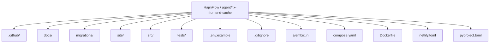
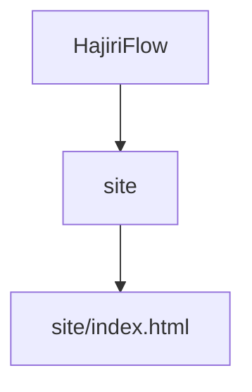
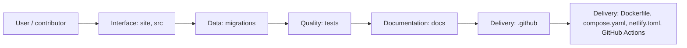
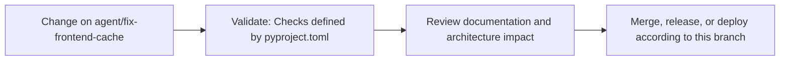

# HajiriFlow

<!-- interactive-readme-standard:start -->

> [!NOTE]
> **Branch-specific documentation:** this section is maintained for [`agent/fix-frontend-cache`](https://github.com/Nischhalsubba/HajiriFlow/tree/agent/fix-frontend-cache). It is generated from the files present on this branch and preserves the project-authored README below.

<details open>
<summary><strong>Interactive repository guide</strong></summary>

## Branch overview

| Item | Value |
|---|---|
| Repository | [`Nischhalsubba/HajiriFlow`](https://github.com/Nischhalsubba/HajiriFlow) |
| Branch | [`agent/fix-frontend-cache`](https://github.com/Nischhalsubba/HajiriFlow/tree/agent/fix-frontend-cache) |
| Detected stack | Python, Docker, Docker Compose, JavaScript, CSS, HTML |
| Detected manifests | pyproject.toml, Dockerfile, compose.yaml |
| Documentation policy | Every maintained branch must explain purpose, setup, structure, architecture, flows, testing, delivery, security, and ownership. |

## Repository structure



The diagram is generated from the branch's actual top-level files and directories. Use the branch link above for complete source navigation.

## Website or application structure



## Application and responsibility flow



## Change-to-delivery flow



## README requirements for this branch

- Explain what this branch contains and how it differs from the default branch.
- Keep installation, configuration, usage, testing, deployment, security, support, and license information accurate.
- Document repository, website or application, API, data, authentication, background-job, and deployment flows when they exist.
- Prefer Mermaid diagrams and expandable `<details>` sections for visual navigation.
- Link diagrams and modules to real source paths; never invent missing components.
- Preserve project-specific documentation and update diagrams whenever architecture or major paths change.
- Treat secrets, private infrastructure, customer data, and credentials as prohibited README content.

</details>

<!-- interactive-readme-standard:end -->

Attendance to payroll, with every record accounted for.

HajiriFlow is a Nepal-ready workforce platform for biometric attendance, employee management, leave, field duty, reporting, employee self-service, and payroll. Device vendors are integrations, not the product architecture.

## Baseline scope

The accepted baseline contains 66 tracked capabilities across:

- secure accounts, multi-role permissions, and redacted audit history;
- company structure, employees, shifts, and effective assignments;
- biometric device registry, diagnostics, scheduling, pulling, identity sync, migration, and encrypted archives;
- immutable raw punches, manual correction approvals, and spreadsheet imports;
- AD/BS calendar services, holidays, leave balances and approvals, and kaaj/field duty;
- a shared attendance engine for daily status, late/early time, overtime, overnight shifts, and locked periods;
- daily, absence, department, monthly, Hajiri, and attendance-to-salary reports with Excel/PDF/print outputs;
- fiscal years, salary heads, deductions, tax slabs, payroll runs, payslips, annual summaries, and employee self-service;
- backup, restore, monitoring, deployment, and recovery controls.

See:

- [Baseline product scope](docs/PRODUCT_SCOPE.md)
- [Feature matrix](docs/FEATURE_MATRIX.md)
- [Implementation sequence](docs/IMPLEMENTATION_SEQUENCE.md)
- [Architecture](docs/ARCHITECTURE.md)
- [Domain model](docs/DATA_MODEL.md)
- [Independent development policy](docs/INDEPENDENT_DEVELOPMENT.md)

## Current status

Foundation infrastructure is complete. Product modules are being implemented in dependency order, beginning with database migrations, identity, and deny-by-default authorization.

## Quick start

```bash
cp .env.example .env
docker compose up --build
```

Web health check: `http://localhost:8000/health`

## Local development

```bash
python -m venv .venv
source .venv/bin/activate  # Windows: .venv\\Scripts\\activate
pip install -e '.[dev]'
cp .env.example .env
uvicorn hajiriflow.main:app --reload
pytest
```

## Architecture principles

1. Raw biometric punches are immutable.
2. PostgreSQL is the sole runtime source of configuration.
3. Web and device-worker processes run separately.
4. Permissions are deny-by-default.
5. Unknown roles never inherit access.
6. Manual or synthetic attendance is attributed, approved where required, and audited.
7. Payroll uses approved and locked attendance snapshots.
8. Device-specific behavior stays behind adapters.
9. User-visible design, implementation, tests, and documentation are independently created for HajiriFlow.

## License

A HajiriFlow license has not yet been selected. Until one is added, all rights are reserved.
