<!-- interactive-readme-standard:start -->

<div align="center">

# HajiriFlow

**Branch-aware technical guide for [`docs/interactive-readme`](https://github.com/Nischhalsubba/HajiriFlow/tree/docs/interactive-readme)**

<p>       </p>

<p>
  <a href="https://github.com/Nischhalsubba/HajiriFlow/tree/docs/interactive-readme"><strong>Browse source</strong></a> ·
  <a href="https://github.com/Nischhalsubba/HajiriFlow/issues"><strong>Issues</strong></a> ·
  <a href="https://github.com/Nischhalsubba/HajiriFlow/codespaces/new?ref=docs%2Finteractive-readme"><strong>Open in Codespaces</strong></a>
</p>

</div>

> [!IMPORTANT]
> This guide is generated from the files actually present on `docs/interactive-readme`. It links to detected source paths, preserves project-authored notes, and avoids claiming components that were not found.

## At a glance

| Item | Detected value |
|---|---|
| Purpose | A web or interface project documented from the files currently present on this branch. |
| Branch role | Compared with `main` |
| Stack | Python, Docker, Docker Compose, JavaScript, CSS, HTML |
| Manifests | pyproject.toml, Dockerfile, compose.yaml |
| Prerequisites | Python |
| Delivery | Dockerfile, compose.yaml, netlify.toml, GitHub Actions |
| License | No license file detected |

## Branch scope

This branch differs from the default branch in the following detected paths:

- [`README.md`](https://github.com/Nischhalsubba/HajiriFlow/blob/docs/interactive-readme/README.md)

## Quick start

```bash
python -m venv .venv
pip install -e .
```

### Configuration surface

- `.env.example`

> Never commit secrets, private keys, production credentials, customer data, or unredacted infrastructure details.

## Repository map

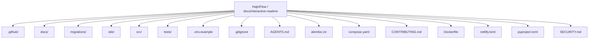

| Responsibility | Detected source paths |
|---|---|
| Interface | [`site`](https://github.com/Nischhalsubba/HajiriFlow/tree/docs/interactive-readme/site), [`src`](https://github.com/Nischhalsubba/HajiriFlow/tree/docs/interactive-readme/src) |
| Data | [`migrations`](https://github.com/Nischhalsubba/HajiriFlow/tree/docs/interactive-readme/migrations) |
| Quality | [`tests`](https://github.com/Nischhalsubba/HajiriFlow/tree/docs/interactive-readme/tests) |
| Documentation | [`docs`](https://github.com/Nischhalsubba/HajiriFlow/tree/docs/interactive-readme/docs) |
| Delivery | [`.github`](https://github.com/Nischhalsubba/HajiriFlow/tree/docs/interactive-readme/.github) |

## Website or application map

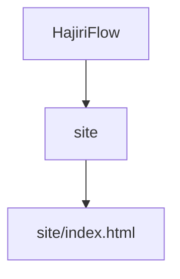

## Architecture and responsibility flow

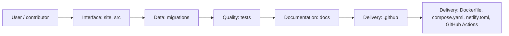

<details>
<summary><strong>Authentication and authorization flow</strong></summary>

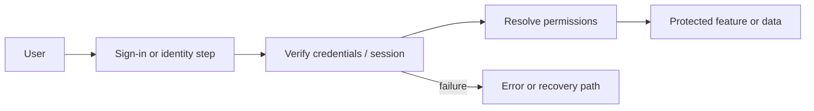

Relevant detected files: [`tests/test_permissions.py`](https://github.com/Nischhalsubba/HajiriFlow/blob/docs/interactive-readme/tests/test_permissions.py), [`src/hajiriflow/identity/permissions.py`](https://github.com/Nischhalsubba/HajiriFlow/blob/docs/interactive-readme/src/hajiriflow/identity/permissions.py), [`src/hajiriflow/db/session.py`](https://github.com/Nischhalsubba/HajiriFlow/blob/docs/interactive-readme/src/hajiriflow/db/session.py).

> The diagram expresses the responsibility sequence only. Confirm exact providers, token formats, roles, and recovery behavior in the linked source.

</details>
<details>
<summary><strong>Data flow and model surface</strong></summary>

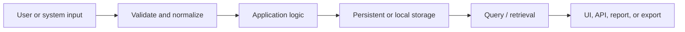

Detected data areas: [`migrations`](https://github.com/Nischhalsubba/HajiriFlow/tree/docs/interactive-readme/migrations), [`migrations/script.py.mako`](https://github.com/Nischhalsubba/HajiriFlow/blob/docs/interactive-readme/migrations/script.py.mako), [`migrations/env.py`](https://github.com/Nischhalsubba/HajiriFlow/blob/docs/interactive-readme/migrations/env.py), [`migrations/versions/20260803_0001_identity_foundation.py`](https://github.com/Nischhalsubba/HajiriFlow/blob/docs/interactive-readme/migrations/versions/20260803_0001_identity_foundation.py), [`tests/test_database.py`](https://github.com/Nischhalsubba/HajiriFlow/blob/docs/interactive-readme/tests/test_database.py), [`src/hajiriflow/db/models/__init__.py`](https://github.com/Nischhalsubba/HajiriFlow/blob/docs/interactive-readme/src/hajiriflow/db/models/__init__.py), [`src/hajiriflow/db/models/identity.py`](https://github.com/Nischhalsubba/HajiriFlow/blob/docs/interactive-readme/src/hajiriflow/db/models/identity.py).

</details>
<details>
<summary><strong>Background jobs and scheduled work</strong></summary>

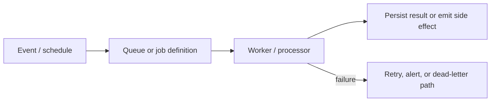

Relevant detected files: [`src/hajiriflow/worker/__init__.py`](https://github.com/Nischhalsubba/HajiriFlow/blob/docs/interactive-readme/src/hajiriflow/worker/__init__.py), [`src/hajiriflow/worker/__main__.py`](https://github.com/Nischhalsubba/HajiriFlow/blob/docs/interactive-readme/src/hajiriflow/worker/__main__.py).

</details>

## Quality, security, and operations

<table>
<tr>
<td width="33%" valign="top">

### Quality

- [`tests`](https://github.com/Nischhalsubba/HajiriFlow/tree/docs/interactive-readme/tests)

Detected commands:
- No standard quality command detected.

</td>
<td width="33%" valign="top">

### Security

- [`SECURITY.md`](https://github.com/Nischhalsubba/HajiriFlow/blob/docs/interactive-readme/SECURITY.md)

Review authentication, authorization, input validation, dependency updates, secret handling, and failure recovery before release.

</td>
<td width="34%" valign="top">

### Observability

- No dedicated observability integration was detected automatically.

Define useful logs, metrics, traces, alerts, and rollback signals for production-facing branches.

</td>
</tr>
</table>

## Delivery flow

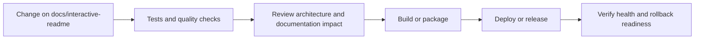

### Automation detected

- [`.github/workflows/ci.yml`](https://github.com/Nischhalsubba/HajiriFlow/blob/docs/interactive-readme/.github/workflows/ci.yml)

## Contribution flow

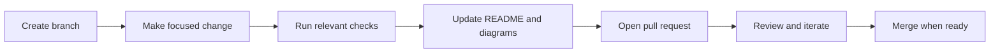

- Keep changes focused and explain architectural consequences.
- Run the checks relevant to the changed area.
- Update diagrams whenever routes, modules, data models, authentication, jobs, or delivery paths change.
- Add screenshots or recordings for visual behavior changes when useful.
- Use issues for reproducible defects and pull requests for reviewable changes.

## Ownership and support

| Topic | Source |
|---|---|
| Repository | [`Nischhalsubba/HajiriFlow`](https://github.com/Nischhalsubba/HajiriFlow) |
| Branch | [`docs/interactive-readme`](https://github.com/Nischhalsubba/HajiriFlow/tree/docs/interactive-readme) |
| Ownership | No CODEOWNERS file detected |
| Contributing | [`CONTRIBUTING.md`](https://github.com/Nischhalsubba/HajiriFlow/blob/docs/interactive-readme/CONTRIBUTING.md) |
| Support | [Open or review issues](https://github.com/Nischhalsubba/HajiriFlow/issues) |
| License | No license file detected |

<details>
<summary><strong>Documentation maintenance checklist</strong></summary>

- [ ] Purpose and branch scope are accurate.
- [ ] Setup and configuration commands still work.
- [ ] Repository, application, API, data, authentication, job, and deployment diagrams match the code.
- [ ] Tests, security controls, observability, and rollback behavior are documented.
- [ ] Links point to real files on this branch.
- [ ] No secrets or private operational details are exposed.

</details>

<!-- interactive-readme-standard:end -->

<!-- project-authored-notes:start -->
<details>
<summary><strong>Project-authored notes preserved from this branch</strong></summary>

<div align="center">
  

  # HajiriFlow

  **Attendance to payroll, with every record accounted for.**

  Nepal-ready workforce operations for biometric attendance, employees, shifts, leave, kaaj, reporting, audit, self-service, and payroll.

  [](https://github.com/Nischhalsubba/HajiriFlow/actions/workflows/ci.yml)
  [](https://hajiriflow.netlify.app/)
  [](https://www.python.org/)
  [](https://fastapi.tiangolo.com/)
  [](https://www.postgresql.org/)
  [](#configuration)
  [](docs/FEATURE_MATRIX.md)
  [](#license)

  [🌐 Open application](https://hajiriflow.netlify.app/) ·
  [📋 Product scope](docs/PRODUCT_SCOPE.md) ·
  [🧩 Feature matrix](docs/FEATURE_MATRIX.md) ·
  [🏗 Architecture](docs/ARCHITECTURE.md) ·
  [🗺 Delivery plan](docs/IMPLEMENTATION_SEQUENCE.md)
</div>

> [!IMPORTANT]
> The public frontend is live and interactive, but its workforce state and uploaded photos are currently stored in the browser. FastAPI, PostgreSQL, authentication, Supabase persistence, real biometric-device communication, and authoritative payroll are not yet connected to the public Netlify site. Do not treat the current public deployment as the system of record for real employees, attendance, or salary.

---

<details open>
<summary><strong>Explore this README</strong></summary>

- [What HajiriFlow does](#what-hajiriflow-does)
- [Current delivery status](#current-delivery-status)
- [End-to-end product flow](#end-to-end-product-flow)
- [System architecture](#system-architecture)
- [Attendance lifecycle](#attendance-lifecycle)
- [Capabilities](#capabilities)
- [Application areas](#application-areas)
- [Roles and access](#roles-and-access)
- [Technology stack](#technology-stack)
- [Repository structure](#repository-structure)
- [Quick start](#quick-start)
- [Configuration](#configuration)
- [Development workflow](#development-workflow)
- [Testing and CI](#testing-and-ci)
- [Security and privacy](#security-and-privacy)
- [Deployment model](#deployment-model)
- [Roadmap](#roadmap)
- [Documentation](#documentation)
- [Contributing](#contributing)
- [Independent development](#independent-development)
- [Media and attribution](#media-and-attribution)
- [License](#license)

</details>

## What HajiriFlow does

HajiriFlow is designed for organizations that need a traceable path from workforce identity to payroll. It keeps biometric evidence, HR decisions, attendance calculations, leave approvals, reports, and payroll controls within one auditable product boundary.

| Question | HajiriFlow answer |
|---|---|
| Who works here? | Employees, organization hierarchy, employment status, roles, and effective assignments |
| What evidence was received? | Immutable punches from devices and approved manual sources |
| How was attendance decided? | Shared shift, holiday, leave, kaaj, duplicate, and overtime rules |
| Who reviewed the result? | Corrections, approvals, audit events, period approval, and lock history |
| How did it affect salary? | Approved attendance snapshots, earnings, deductions, tax, and payslips |

### Product principles

1. **Evidence before conclusions.** Raw biometric punches remain immutable.
2. **One policy engine.** Screens, reports, and payroll use the same attendance decisions.
3. **Deny by default.** Unknown roles and missing permissions grant nothing.
4. **PostgreSQL as runtime truth.** Device, schedule, employee, and policy configuration do not come from stray JSON files.
5. **Separate web and worker processes.** Device pulls cannot block browser requests.
6. **Corrections are additive.** Manual changes retain actor, reason, timestamps, and approval history.
7. **Payroll consumes locked attendance.** Unapproved attendance must not silently become salary.
8. **Device vendors are adapters.** HajiriFlow is not branded or architected around one hardware manufacturer.
9. **Nepal is a first-class context.** `Asia/Kathmandu`, AD/BS dates, Saturday rules, local reporting, and BS fiscal periods are explicit.

## Current delivery status

| Layer | Status | What exists today |
|---|:---:|---|
| Public frontend | 🟢 Live | Nine responsive routes, dynamic browser state, filters, dialogs, exports, skeleton loading, Motion animations, portraits, and accessible navigation |
| FastAPI foundation | 🟢 Foundation | Application package, validated settings, health/readiness endpoints, database lifecycle, and worker entry point |
| Database migrations | 🟢 Foundation | Alembic setup and initial identity/security schema |
| Identity and RBAC | 🟡 In progress | Accounts, roles, permissions, scoped assignments, revocable sessions, password hashing, login-attempt records, and redacted audit models; complete login/admin workflows remain pending |
| PostgreSQL local environment | 🟢 Available | PostgreSQL 17 through Docker Compose with migration-first startup |
| Supabase production persistence | ⚪ Not connected | Planned provider for shared authentication, database, storage, and row-level security |
| Biometric worker | 🟡 Scaffolded | Separate process boundary exists; production adapter, scheduling, locking, and device communication remain pending |
| Attendance engine | ⚪ Planned | Baseline rules and exit tests documented; production engine not implemented |
| Leave and kaaj | 🟡 UI preview | Interactive browser workflows exist; authoritative server persistence and permissions remain pending |
| Reports | 🟡 UI preview | Browser-generated previews and exports exist; production reports must reconcile with the shared engine |
| Payroll | 🟡 UI preview | Interactive preview exists; it is not an authoritative payroll ledger |
| Production operations | ⚪ Planned | Backup, restore, monitoring, alerts, deployment hardening, and disaster-recovery exercises remain pending |

> [!NOTE]
> “A screen exists” and “the capability is verified” are intentionally different states. The authoritative acceptance ledger is the [66-capability feature matrix](docs/FEATURE_MATRIX.md).

## End-to-end product flow

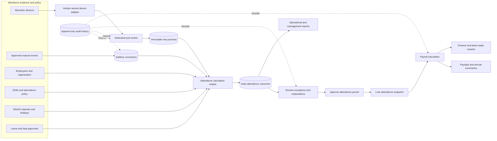

## System architecture

HajiriFlow begins as a modular monolith with two independently deployable Python processes and a separately hosted browser frontend.

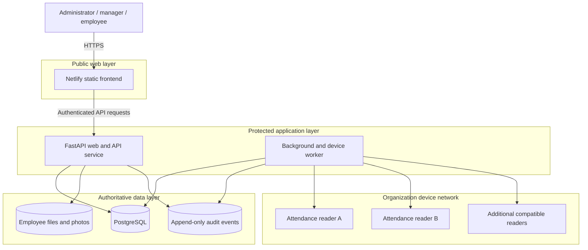

### Module boundaries

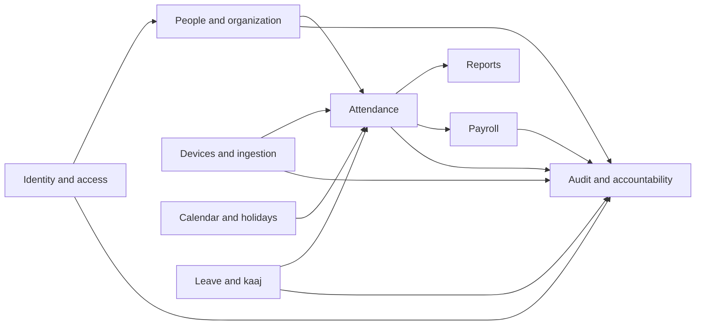

## Attendance lifecycle

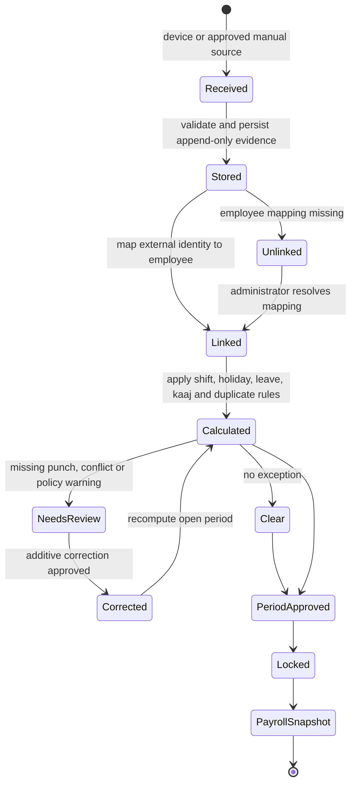

### Authorization decision

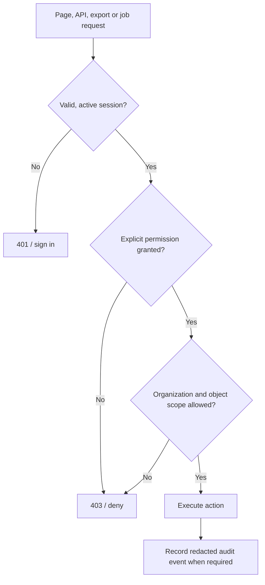

## Capabilities

The accepted baseline contains **66 capabilities** across nine dependency-ordered milestones.

<details open>
<summary><strong>Identity, security, and accountability</strong></summary>

- Secure login, logout, password lifecycle, account activation, and throttling
- Revocable sessions and login-attempt history
- Multiple roles per account
- Global and organization-scoped permissions
- Page, API, export, background-job, and object-level authorization
- Employee-linked accounts and self-service boundaries
- Append-only administrative audit events
- Recursive redaction of credentials, biometrics, bank data, identity numbers, and tokens

</details>

<details>
<summary><strong>Organization, employees, and shifts</strong></summary>

- Company profile and report identity
- Directorate, department, section, and unit hierarchy
- Employee lifecycle, attendance IDs, HR numbers, employment type, designation, grade, contacts, and payroll references
- Effective organization, account, and shift assignments
- Search, filtering, pagination, exports, print views, soft deactivation, and restoration
- Shift start/end, breaks, grace periods, weekly offs, and cross-midnight support
- Mapping one employee to multiple physical-device registrations

</details>

<details>
<summary><strong>Devices and biometric ingestion</strong></summary>

- Vendor-neutral device registry and capability-based adapters
- Encrypted communication secrets and sanitized diagnostics
- Connection testing, last-seen metadata, firmware/model information, and device health
- PostgreSQL-backed schedules and immediate pull commands
- Distributed per-device locking and bounded retries
- Pull-session history and per-device failure isolation
- Historical pulls where supported
- Device-user inventory, comparison, enrollment, synchronization, migration, encrypted archive, and controlled restore
- Immutable and idempotent punch ingestion
- Unlinked-punch review without evidence loss

</details>

<details>
<summary><strong>Attendance, corrections, and policy</strong></summary>

- Raw event explorer with device, employee, date, source, and type filters
- Approved manual event entry and spreadsheet import preview
- Additive corrections and day-level remarks
- Duplicate-event policy without deleting raw evidence
- Effective shift resolution and overnight workdays
- First in, last out, worked time, planned time, late arrival, early departure, regular overtime, and holiday overtime
- Deterministic daily status and explanation trace
- Safe recomputation of open periods
- Explicit correction and reapproval for locked periods

</details>

<details>
<summary><strong>BS calendar, holidays, leave, and kaaj</strong></summary>

- Bidirectional AD/BS conversion and BS month metadata
- Holiday categories, colors, ordering, organization scope, and working-day calculation
- Leave-type policy, entitlement, carry-forward, caps, half days, eligibility, and paid status
- Opening, earned, carried, used, pending, and available balances
- Previewed annual allocation
- Employee request, approval, rejection, cancellation, and attachment metadata
- Paid or unpaid official field-duty / kaaj workflow
- Shared workday decisions across leave, attendance, reports, and payroll

</details>

<details>
<summary><strong>Reports and employee self-service</strong></summary>

- Attendance event explorer
- Daily workforce status
- Daily absence register
- Department coverage and employee drilldown
- Employee monthly detail
- Monthly workforce summary
- BS Hajiri register
- Attendance-to-salary reconciliation worksheet
- Print, PDF, Excel, and CSV outputs with permission-scoped data
- Employee access to personal attendance, leave, kaaj, profile, and payslips

</details>

<details>
<summary><strong>Payroll</strong></summary>

- BS fiscal-year lifecycle with AD boundaries
- Earning-head and deduction catalogs
- Effective employee compensation assignments
- Holiday overtime and expected-hours policies
- Versioned tax-slab sets and taxpayer categories
- Attendance review before generation
- Immutable identity, attendance, policy, earning, deduction, tax, and money snapshots
- Preview, approval, posting, reversal, closing, and locking
- Payslips, annual summaries, tax projection, and export workflows

</details>

<details>
<summary><strong>Operations and recovery</strong></summary>

- Health and readiness endpoints
- Structured logs and request/job correlation
- Monitoring, metrics, warnings, and alerts without sensitive payloads
- Versioned migrations that fail deployment on error
- PostgreSQL backup, restore, retention, and verification procedures
- Linux web and worker services
- Security review, load testing, dependency review, rollback, and disaster-recovery exercise

</details>

## Application areas

| Route | Purpose | Current public behavior |
|---|---|---|
| `#overview` | Daily workforce operations | KPIs, attendance trend, exceptions, device health, department distribution, and recent activity |
| `#attendance` | Attendance evidence and corrections | Date navigation, filters, employee status, punch details, correction dialogs, and CSV export |
| `#employees` | Employee directory | Search, filters, profiles, add/edit workflows, human portraits, and photo replacement |
| `#leave` | Leave and kaaj | Requests, balances, approval/rejection actions, and field-duty entry |
| `#reports` | Operational reports | Report catalog, parameters, preview behavior, and export workflows |
| `#devices` | Biometric readers | Registry, status, test/pull/sync simulations, and device forms |
| `#payroll` | Payroll preparation | Periods, readiness indicators, preview calculation, and lifecycle actions |
| `#organization` | Company structure | Departments, units, shifts, and organization settings |
| `#settings` | Workspace behavior | Appearance, density, snapshot export, and application preferences |

## Roles and access

| Role | Typical responsibility |
|---|---|
| System administrator | Platform configuration, access control, integrations, audit, and recovery |
| Attendance administrator | Employees, devices, shifts, attendance corrections, leave, holidays, and reports |
| Attendance operator | Routine pulls, imports, exception queues, and non-destructive attendance operations |
| Leave approver | Leave and kaaj decisions within assigned organization scope |
| Payroll administrator | Fiscal years, compensation policy, attendance review, payroll runs, and exports |
| Report viewer | Read-only access to explicitly authorized reports |
| Employee | Own attendance, leave, kaaj, profile, and payslips |

Unknown roles and permissions are denied. A role name is never treated as magical access merely because somebody typed it into a database.

## Technology stack

| Area | Technology |
|---|---|
| Frontend | Static HTML, CSS, and JavaScript application hosted on Netlify |
| Interaction and motion | Motion `12.42.1`, native browser APIs, reduced-motion support |
| Backend | Python 3.12+, FastAPI, Uvicorn |
| Persistence | PostgreSQL 17, SQLAlchemy 2, Psycopg 3 |
| Migrations | Alembic |
| Password security | Argon2 via `argon2-cffi` |
| Configuration | Pydantic Settings and `HAJIRIFLOW_*` environment variables |
| Testing | Pytest, pytest-cov, Ruff, Node syntax validation |
| Local orchestration | Docker and Docker Compose |
| Business timezone | `Asia/Kathmandu` |
| Planned shared cloud layer | Supabase Auth, PostgreSQL, Storage, Realtime, and RLS |
| Device integration | Dedicated private worker with vendor adapters |

## Repository structure

```text
HajiriFlow/
├── site/                       # Netlify frontend application
│   ├── index.html
│   └── assets/                 # Styles, route renderer, data provider, media and motion
├── src/hajiriflow/             # FastAPI package, configuration, DB, security and worker
├── migrations/                 # Alembic migration environment and revisions
├── tests/                      # Backend, security and frontend contract tests
├── docs/                       # Product, architecture, design and delivery documentation
├── compose.yaml                # PostgreSQL, migration, web and worker services
├── Dockerfile                  # Python service image
├── netlify.toml                # Static publish path, redirects, CSP and headers
├── pyproject.toml              # Package metadata, dependencies, Ruff and Pytest settings
├── .env.example                # Safe configuration template
└── README.md                   # You are here, bravely reading documentation
```

## Quick start

### Option A: Docker Compose

Requirements:

- Docker Engine or Docker Desktop
- Docker Compose v2

```bash
git clone https://github.com/Nischhalsubba/HajiriFlow.git
cd HajiriFlow
cp .env.example .env
docker compose up --build
```

Services:

| Service | Address / purpose |
|---|---|
| Frontend | Use the [live Netlify application](https://hajiriflow.netlify.app/) or serve `site/` locally |
| FastAPI | `http://localhost:8000` |
| Health | `http://localhost:8000/health` |
| Readiness | `http://localhost:8000/ready` |
| PostgreSQL | `localhost:5432` |
| Worker | Runs as a separate Compose service |

Stop the stack:

```bash
docker compose down
```

Remove the local database volume as well:

```bash
docker compose down -v
```

### Option B: Local Python development

```bash
git clone https://github.com/Nischhalsubba/HajiriFlow.git
cd HajiriFlow
python -m venv .venv
```

Activate the environment:

```bash
# Linux or macOS

source .venv/bin/activate

# Windows PowerShell
.venv\Scripts\Activate.ps1
```

Install dependencies and create configuration:

```bash
pip install -e '.[dev]'
cp .env.example .env
```

On Windows PowerShell, copy the environment file with:

```powershell
Copy-Item .env.example .env
```

Start PostgreSQL and apply migrations:

```bash
docker compose up -d db
alembic upgrade head
```

Run the API:

```bash
uvicorn hajiriflow.main:app --reload
```

Run the worker in another terminal:

```bash
python -m hajiriflow.worker
```

Serve the frontend locally:

```bash
python -m http.server 4173 --directory site
```

Open `http://localhost:4173`.

## Configuration

Copy `.env.example` to `.env` and replace development placeholders.

| Variable | Required | Example | Purpose |
|---|:---:|---|---|
| `HAJIRIFLOW_ENVIRONMENT` | Yes | `development` | Runtime environment name |
| `HAJIRIFLOW_DATABASE_URL` | Yes | `postgresql+psycopg://...` | SQLAlchemy PostgreSQL connection URL |
| `HAJIRIFLOW_SESSION_SECRET` | Yes | 32+ random characters | Session signing and security material |
| `HAJIRIFLOW_TIMEZONE` | Yes | `Asia/Kathmandu` | Business-local date and time rules |
| `HAJIRIFLOW_LOG_LEVEL` | Yes | `INFO` | Application logging threshold |

> [!CAUTION]
> Never commit `.env`, device passwords, database credentials, Supabase service-role keys, session secrets, biometric templates, payroll exports, or real employee data.

## Development workflow

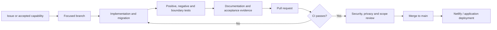

Rules:

- One vertical slice or one infrastructure concern per pull request.
- Every schema change uses an Alembic migration.
- Every permission change includes allowed and denied tests.
- Every financial calculation includes fixed examples and boundary tests.
- Every export is reviewed for organization and employee-scope leakage.
- Feature status changes in the same pull request as the implementation.
- Unfinished buttons and placeholder routes do not count as verified capabilities. Humanity has enough doors opening into drywall.

## Testing and CI

Install development dependencies:

```bash
pip install -e '.[dev]'
```

Run linting:

```bash
ruff check .
```

Run the test suite with coverage:

```bash
pytest --cov=hajiriflow --cov-report=term-missing
```

Validate a frontend JavaScript file:

```bash
node --check site/assets/app-v3.js
```

GitHub Actions validates:

- Python 3.12 setup
- Editable package installation
- Ruff linting
- Syntax of every JavaScript asset
- Pytest and coverage execution
- Frontend architecture, loading, CSP, responsive, media, and interaction contracts

## Security and privacy

### Implemented foundations

- Argon2 password hashing
- Revocable session records represented by token hashes
- Accounts, roles, permissions, and organization-scoped assignments
- Deny-by-default permission evaluation
- Login-attempt records
- Append-only audit-event model
- Recursive audit redaction
- Database-aware readiness checks
- Content Security Policy, frame protection, content-type protection, referrer policy, and restricted permissions policy on Netlify
- Startup watchdog and recoverable frontend failure state

### Required production invariants

- Raw punches cannot be edited or deleted through ordinary workflows.
- Manual corrections must retain actor, reason, source, timestamps, and approval.
- Unknown roles grant no access.
- Device credentials and biometric archives must be encrypted at rest.
- Password hashes, secrets, bank details, identity numbers, and biometric templates must never enter ordinary audit payloads.
- Each device pull must use a distributed lock.
- Payroll generation requires an approved and locked attendance period.
- Exports must enforce the same permission and organization scope as screens and APIs.
- Employee photographs require an approved retention, consent, and deletion policy before real deployment.

Security reports should follow [SECURITY.md](SECURITY.md) rather than public issue disclosure.

## Deployment model

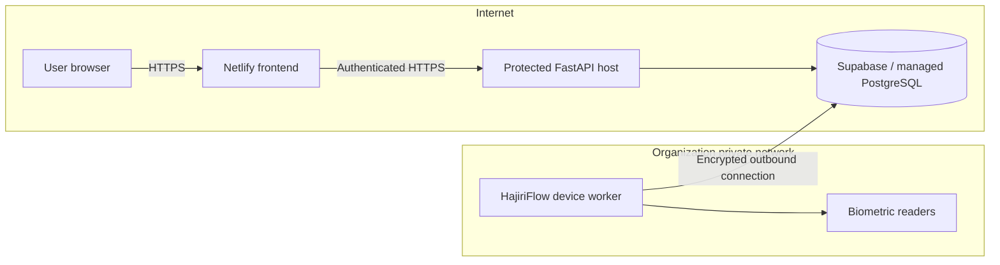

### Why the worker is separate

Biometric devices usually live on a private LAN and require persistent network access. Netlify serves the public frontend; it does not run a continuously connected Python process beside a physical attendance reader. The private worker must run on a trusted host that can reach the devices and the authoritative data layer.

### Environment split

| Environment | Frontend | API | Database | Worker |
|---|---|---|---|---|
| Local development | Local static server | Uvicorn | Docker PostgreSQL | Local Python process |
| Public preview | Netlify | Not connected to public frontend | Browser-local state | Simulated UI actions |
| Target production | Netlify or approved web host | Protected Python host | Supabase / managed PostgreSQL | Trusted private-network host |

## Roadmap

| Milestone | Scope | Status |
|---:|---|:---:|
| Experience track | Responsive product UI, dynamic provider, routes, loading, motion, media, exports, and Netlify deployment | 🟢 Live preview |
| 1 | Persistence, identity, authorization, sessions, CSRF, throttling, and audit | 🟡 In progress |
| 2 | Organization, employees, company settings, shifts, and effective assignments | ⚪ Planned |
| 3 | BS calendar, holidays, leave, balances, approvals, and kaaj | ⚪ Planned |
| 4 | Device platform, diagnostics, worker scheduling, and immutable raw evidence | ⚪ Planned |
| 5 | Device identity sync, enrollment, migration, archive, and restore | ⚪ Planned |
| 6 | Manual corrections and deterministic attendance engine | ⚪ Planned |
| 7 | Reconciled attendance reports, exports, and employee self-service | ⚪ Planned |
| 8 | Payroll policy, generation, lifecycle, payslips, and annual summaries | ⚪ Planned |
| 9 | Monitoring, backup, restore, production services, security review, and disaster recovery | ⚪ Planned |

A milestone is complete only when it has runnable software, migrations where needed, permission tests, acceptance evidence, and user documentation.

## Documentation

| Document | Purpose |
|---|---|
| [Product scope](docs/PRODUCT_SCOPE.md) | Complete baseline requirements and product goals |
| [Feature matrix](docs/FEATURE_MATRIX.md) | Capability IDs, dependencies, acceptance criteria, and status |
| [Implementation sequence](docs/IMPLEMENTATION_SEQUENCE.md) | Nine dependency-ordered milestones and exit tests |
| [Architecture](docs/ARCHITECTURE.md) | Processes, data flow, module boundaries, and non-negotiable controls |
| [Domain model](docs/DATA_MODEL.md) | Conceptual entities, relationships, and invariants |
| [Frontend design system](docs/FRONTEND_DESIGN_SYSTEM.md) | Color, typography, spacing, layout, components, motion, voice, and anti-patterns |
| [Independent development policy](docs/INDEPENDENT_DEVELOPMENT.md) | Original implementation and third-party boundary rules |
| [Security policy](SECURITY.md) | Responsible vulnerability reporting |
| [Contribution guide](CONTRIBUTING.md) | Development and pull-request expectations |
| [Agent guide](AGENTS.md) | Repository rules for coding assistants and automation |

## Contributing

1. Read the [product scope](docs/PRODUCT_SCOPE.md) and [feature matrix](docs/FEATURE_MATRIX.md).
2. Select an existing issue or create a focused proposal.
3. Branch from `main`.
4. Implement one coherent slice with tests and documentation.
5. Run linting and tests locally.
6. Open a pull request using the repository template.
7. Address CI, privacy, authorization, audit, migration, and originality checks.

```bash
git checkout main
git pull
git checkout -b feature/short-descriptive-name
```

Read [CONTRIBUTING.md](CONTRIBUTING.md) before changing schema, permissions, exports, financial calculations, device operations, or audit behavior.

## Independent development

HajiriFlow is an independently designed personal project.

- Do not copy third-party source code, templates, CSS, JavaScript, documentation wording, database migrations, screenshots, logos, or assets without an explicit compatible license and required attribution.
- General product capabilities may be independently implemented from written requirements and public behavior.
- Device vendors remain replaceable integrations.
- Pull requests include originality, security, privacy, and attribution checks.

See [docs/INDEPENDENT_DEVELOPMENT.md](docs/INDEPENDENT_DEVELOPMENT.md).

## Media and attribution

- The HajiriFlow logo and interface assets in this repository are original project assets.
- Current public-preview employee portraits are loaded from selected Unsplash image URLs.
- Uploaded replacement photos are cropped in the browser and currently stored only in that browser's local storage.
- Production employee photography must move to authenticated storage with consent, access control, retention, and deletion rules.
- Motion is loaded from a version-pinned open-source browser bundle.

External services are presentation dependencies only; operational attendance and payroll must not depend on portrait or animation availability.

## License

A public software license has not yet been selected. Until a license file is added, **all rights are reserved**.

That means the repository is publicly visible, not automatically open source. Visibility and permission are different concepts, an inconvenience the internet repeatedly rediscovers.

---

<div align="center">
  <strong>HajiriFlow</strong><br>
  Nepal-ready workforce evidence, decisions, and payroll accountability.
</div>

</details>
<!-- project-authored-notes:end -->
