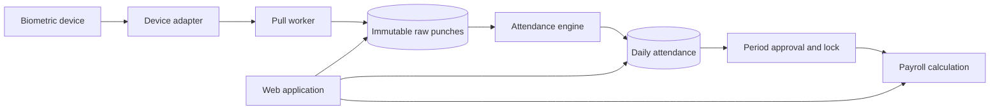

# Architecture

HajiriFlow begins as a modular monolith with two deployable processes:

1. `hajiriflow-web`: HTTP application, administration, reports, approvals, and APIs.
2. `hajiriflow-worker`: device communication, scheduled pulls, settlement jobs, and exports.

Both processes use PostgreSQL. The database is the only runtime source of device, schedule, employee, and policy configuration.

## Data flow

## Module boundaries

- `identity`: users, roles, sessions, permissions.
- `people`: employees and organisation hierarchy.
- `devices`: adapters, device registry, sync runs, diagnostics.
- `attendance`: raw punches, deduplication, shifts, settlement, corrections.
- `leave`: leave types, balances, applications, approvals.
- `calendar`: BS/AD dates, weekends, holidays.
- `reports`: attendance and management exports.
- `payroll`: approved periods, earnings, deductions, payslips.
- `audit`: append-only administrative event records.

## Non-negotiable controls

- Raw punches are never edited or deleted through normal application flows.
- Corrections are additive and retain actor, reason, source, and timestamps.
- Unknown roles are denied access.
- Device credentials are encrypted at rest.
- Audit payloads never contain password hashes, biometric templates, or bank details.
- One distributed lock protects each device pull.
- Payroll requires an approved and locked attendance period.
